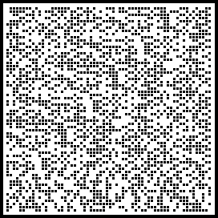
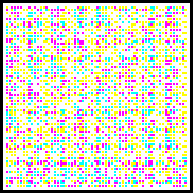
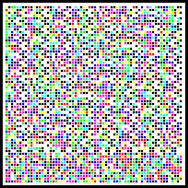

# ColorSafe

A data matrix for printing on paper. Inspired by
[PaperBak](https://github.com/Rupan/paperbak), ColorSafe is written with modern
methods and technologies and is cross-platform. It aims to allow a few
Megabytes of data (or more) to be stored on paper for a worst case scenario
backup, for extremely long-term archiving, or just for fun. With best
practices, ColorSafe encoded data can safely withstand the viccissitudes of
technology changes over long periods of time.

# Examples

ColorSafe encoded data with default black and white settings looks like this:

With a color depth of 2 (Cyan, Magenta, Yellow, White) it looks like this:

With a color depth of 3 (Black, Red, Green, Yellow, Blue, Magenta, Cyan, White)
it looks like this:

Check out the images folder to see sample images of full pages.

# Usage

To install:

``python setup.py install``

To encode a file with default settings, e.g. 100dpi:

``colorsafe encode input.txt``

This generates a single pdf and multiple png files with the black and white
data matrices, which can then be printed and stored.

To decode (black/white only), scan each image back at 3x resolution, e.g.
300dpi, and run decoding:

``colorsafe decode scannedpage_0.bmp``

Which outputs the data on the given pages.

Try the argument -c 2 or 3 for colorized encoding modes.
